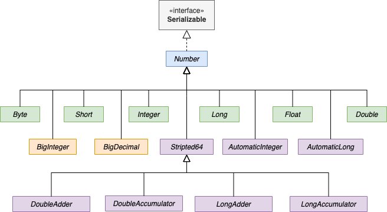

# 数字和字符串

## 数字

数字类的继承关系



大体上分为3类

**包装类型**

Byte、Short、Integer、Long、FLoat、Double这6个类对应相应的基本类型，和基本类型可以互相拆箱和装箱

**大数**

BigInteger和BigDecimal是java.math包中的类，其作用是为了精确表示浮点数，以及整数的大数计算

**原子操作类**

AutomaticInteger、AutomaticLong、Scripted64这几个类是java.util.concurrent.atomic包中的类，用来处理原子性操作的。

基本类型的自增和自减操作，实际上是可以拆解成n=n+1(或n=n-1)，不具备原子性，因此增加了原子类来做原子性的计算。

除了图中列出的几个，还有AutomaticBoolean等原子类，只是不继承Number

## 字符串

### String*

Java中String是一个final类型的类，官网文档上说它算是基本类型，但是它是一个类。

创建字符串的方式有2中：

```Java
String s1 = "abc";
String s2 = new String("abs");
```

**常量池**

Java中的字符串常量池(String Pool)是存储在堆中的中的字符串池。


如果直接通过""创建的字符串时，会先从常量池中找，如果存在，则返回返回其引用，否则会先在常量池中创建对象。通过new String()的方式创建的字符串则会在堆中创建新的字符串对象。调用intern()方法可以将字符串放入到常量池中。

使用常量池的好处是复用了对象，减少了对象的内存占用。


### StringBuilder

### StringBuffer


*参考*

1. [Oracle-数字与字符串](https://docs.oracle.com/javase/tutorial/java/data/index.html)
2. [The Java® Language Specification 3.10.5. String Literals](https://docs.oracle.com/javase/specs/jls/se8/html/jls-3.html#jls-3.10.5)
