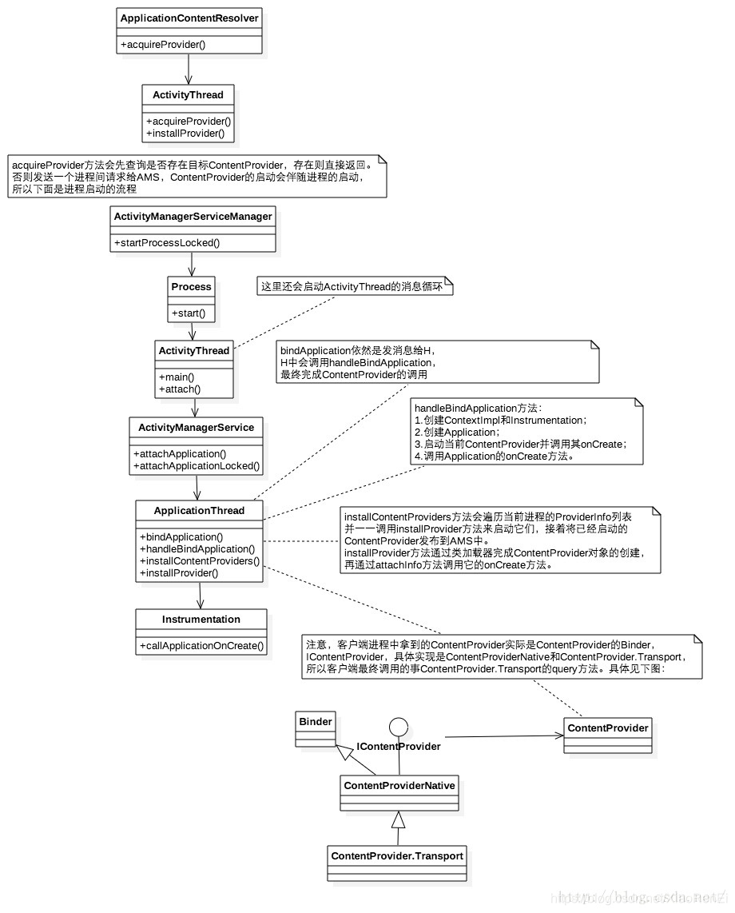

# ContentProvider

ContentProvider 可以帮助应用管理对自身存储或由其他应用存储的数据的访问，并提供与其他应用共享数据的方法。它们封装数据，并提供用于定义数据安全性的机制。ContentProvider 是将一个进程中的数据与另一个进程中运行的代码连接的标准接口。

实现 ContentProvider 有诸多优势。通过配置 ContentProvider，让其他应用安全地访问和修改您的应用数据。


ContentProvider对外暴露的统一的接口，业务方使用时只需要使用统一的 uri 访问数据即可，无需关系存储的实现。在ContentProvider的实现侧，数据存储可以用sqlite，文件，sharedpreference，甚至是assets。

## 使用

**自定义ContentProvider**

实现ContentProvider必须实现onCreate和增删改查方法。

```Java
public class ExampleProvider extends ContentProvider {

    // 声明数据库
    private AppDatabase appDatabase;

    // 定义DAO
    private UserDao userDao;

    private static final String DBNAME = "userdb";

    public boolean onCreate() {

        // 创建db对象
        appDatabase = Room.databaseBuilder(getContext(), AppDatabase.class, DBNAME).build();

        // 获取dao
        userDao = appDatabase.getUserDao();

        return true;
    }
    ...
    // 实现insert方法
    @Override
    public @Nullable Uri insert(@NonNull Uri uri, @Nullable ContentValues values) {
        // 这里可以使用UriMatcher来匹配Uri
    }

    //实现insert方法
    @Override
    public int update(@NonNull Uri uri, @Nullable ContentValues values,
            @Nullable String selection, @Nullable String[] selectionArgs) {
        ...
    }

    // 实现delete方法
    @Override
    public int delete(@NonNull Uri uri, @Nullable String selection,
            @Nullable String[] selectionArgs) {
        ... 
    }

    // 实现query方法
    @Override
    public @Nullable Cursor query(@NonNull Uri uri, @Nullable String[] projection,
            @Nullable String selection, @Nullable String[] selectionArgs,
            @Nullable String sortOrder) {
        ...
    }
}
```

## 原理



应用启动时，先创建ContextImpl和Instrumentation，接着创建Application，查找当前进程的ContentProvider，创建ContentProvider的对象，同时调用onCreate()方法。

调用contentResolver的query、update、insert、delete方法时，获取到的ContentResolver实际是ApplicationContentResolver，通过acquireProvider()方法查找对应的ContentProvider是否存在，如果存在直接返回，否则会走到启动进程的流程，在ActivityThread中调用instalProvider()，启动对应的ContentProvider，并调用onCreate方法。

***参考***

[Android Developer ContentProvider简介](https://developer.android.google.cn/guide/topics/providers/content-providers?hl=zh-cn)  
[CSDN-ContentProvider工作原理——独家秘方](https://blog.csdn.net/XiaoRenEi/article/details/109715763)  