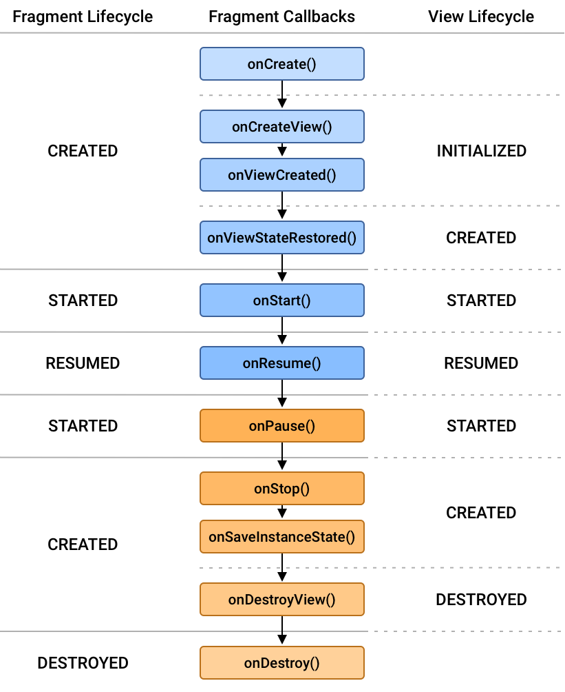

# Fragment

Fragment是应用界面上的可以用来重用的组件，它有自己的视图(也可以没有)，也有自己的生命周期，不能独立存在，只能依附于Activity或者其他的Fragment存在。最终渲染时，Fragment会作为一个单独的View加到Activity上。

## Fragment的使用

绝大多数的场景下，都需要自己继承Fragment类，来实现自己的业务逻辑。

```Java
class ExampleFragment extends Fragment {
    public ExampleFragment() {
        super(R.layout.example_fragment);
    }
}
```

使用时，有2种方法将Fragment加到页面上：

- 通过xml加载   
```xml
<!-- res/layout/example_activity.xml -->
<androidx.fragment.app.FragmentContainerView
    xmlns:android="http://schemas.android.com/apk/res/android"
    android:id="@+id/fragment_container_view"
    android:layout_width="match_parent"
    android:layout_height="match_parent" />
```
不使用androidx时，也可以直接在xml中写fragment标签
```xml
<fragment
    android:id="@+id/example_fragment"
    android:layout_width="match_parent"
    android:layout_height="match_parent"
    android:name="com.example.ExampleFragment" />
```

- 以代码的形式通过FragmentManager加载   
```Java
public class ExampleActivity extends AppCompatActivity {
    public ExampleActivity() {
        super(R.layout.example_activity);
    }
    @Override
    protected void onCreate(Bundle savedInstanceState) {
        super.onCreate(savedInstanceState);
        if (savedInstanceState == null) {
            getSupportFragmentManager().beginTransaction()
                .setReorderingAllowed(true)
                .add(R.id.fragment_container_view, ExampleFragment.class, "tag_fragment_example")
                .commit();
        }
    }
}
```

## FragmentManager与FragmentTransaction

Fragment的操作都是通过FragmentTransaction和FragmentTransaction来实现的。

FragmentManager可以通过FragmentActivity及其子类的`getSupportFragmentManager()`方法获取，通过`fragmentManager.beginTransaction()`可以开启一个事务，事务中可以进行Fragment的各种操作。

常用的FragmentManager的方法包括：

-  findFragmentById(int)，id即Fragment容器View的id
-  findFragmentByTag(String)，tag是fragmentTranstation.add()时指定的tag

对Fragment的操作几乎都是通过FramentTransaction来实现的，常见的操作包括：

- add/remove/replace 从界面上添加/移除/替换Fragment，会触发onCreateView/onViewDestroy方法
- show/hide 显示和隐藏，会触发onHiddenChange()方法
- detach/attach 从界面上暂时移除/添加Fragment，不同与add/remove，Fragment的状态仍然由FragmentManager维护
- setPrimaryNavigation() 设置当前活跃的Fragment
- setMaxLifecycle() 设置最大的生命周期状态，如果设置的状态比当前的状态更小，则会强制回退状态
- commit/commitAllowingStateLoss 异步提交事务，commitAllowingStateLoss会在执行时不检查Fragment的状态
- commitNow/commitNowAllowingStateLoss 同步提交事务

## 回退栈

同Activity类似，FragmentManager中也维护了一个栈，栈中的每个元素都是BackRacod，它是FragmentTransaction的子类。在执行Fragment的事务时，通过`transaction.addBackRecord()`将当前的操作加入到栈中，通过`fragmentManager.popBackStack()`可以进行出栈操作。

当按返回按钮时，会执行事务的出栈操作，当没有可以出栈的事务后，会执行到Activity的onBackPress方法中。

通过`supportFragmentManager.saveBackStack(String)`和`supportFragmentManager.restoreBackStack(String)`也可以进行事务状态的保存和恢复。

## 生命周期



## 状态保存

## 通信

## Fragment事务的工作原理

*参考*

[Android Developer Fragment简介](https://developer.android.google.cn/guide/fragments?hl=zh-cn)