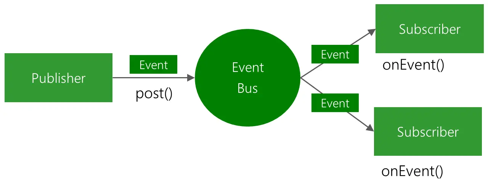

# EventBus

## 简介



EventBus是一个轻量级的组件通信框架，通过发布订阅模式实现了模块间通信，解耦。

## EventBus的用法

注册与解注册

```Java
//3.x版本的注册
EventBus.getDefault().register(this);

//2.x版本的注册
EventBus.getDefault().register(this);
EventBus.getDefault().register(this, 100);
EventBus.getDefault().registerSticky(this, 100);
EventBus.getDefault().registerSticky(this);

//解注册
EventBus.getDefault().unregister(this);
```

响应事件

```Java
//3.x版本
@Subscribe(threadMode = ThreadMode.BACKGROUND, sticky = true, priority = 100)
public void test(String str) {

}

//2.x版本
public void onEvent(String str) {

}
public void onEventMainThread(String str) {

}
public void onEventBackgroundThread(String str) {

}
```

发送事件

```Java
EventBus.getDefault().postEvent("event");
EventBus.getDefault().postSticky("event");
```

postEvent()是普通的用法，只有订阅了该事件的Subscriber才能接受到事件。  
postSticky()叫黏性事件，即使发送事件时没有注册，在注册后也同样能收到事件。

## EventBus的原理

- EventBus.getDefault()通过单例模式获取EventBus的对象；
- register()，2.x的版本中，通过反射，找到onEventXxx方法，将类和方法信息缓存起来。在3.0版本中除了通过反射，通过注解，在编译期生成订阅者信息，保存起来。
- post(Object)，获取到PostingThreadState对象（ThreadLocal），确定发送的线程，将事件加入队列（list），发送出去。发送时根据事件的类型，是在主线程或者是后台线程，通过不同HandlerPoster，发送到不同的线程。

[EventBus 3.0 源码分析](http://www.jianshu.com/p/f057c460c77e)
